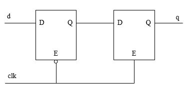
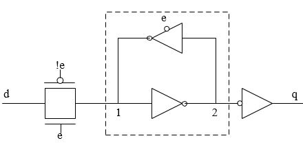
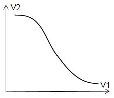

## vlog_day17:亚稳态
by [WeiLin](https://github.com/xLinWei)

我们知道如果触发器不满足建立时间、保持时间约束时会进入亚稳态，那么亚稳态是什么，以及为什么要满足建立保持时间约束？

触发器和锁存器是记忆存储元件，不同的是触发器是边沿敏感，而锁存器是电平敏感。所以触发器可以由两个锁存器构成：

如上图所示，一个锁存器低电平锁存，一个锁存器高电平锁存，从而构成了上升沿敏感的主从触发器。而锁存器的CMOS电路如下图所示：

当e=1，传输门打开，三态反相器关闭，q=d；当e=0，传输门关闭，三态反相器打开，输入被采样到节点1并锁存。这就是锁存器的工作原理。

锁存器之所以能够锁存就是因为其结构中有两个反相器环形连接，节点1和节点2有三种稳定状态：节点1电压为1，节点2电压为0；节点1电压为0，节点2电压为1；节点1电压为0.5，节点2电压为0.5；前两种为稳态，后一种为亚稳态。之所以称为亚稳态，是因为一旦有稍微的电压扰动，亚稳态就会向两个稳态偏，因为这种扰动是未知的，所以最终会偏向哪个稳态是未知的，所以应该避免亚稳态。而且需要注意的是从亚稳态恢复到稳态需要花费很长的时间，所以极力避免亚稳态的产生。

而为什么需要满足建立/保持时间约束，就是希望时钟沿采集d信号时(即传输门关闭时刻)节点1电压为稳定的，而不是0和1之间的电压值，否者也需要花费较长的时间恢复到稳态。

对于异步信号来讲，亚稳态是不能完全避免的，所以需要同步。最简单的两级触发器，其同步原理就是让信号等待1个时钟(这期间足够从亚稳态恢复到稳态)。当然还有其它复杂的同步方法，后面会介绍。

