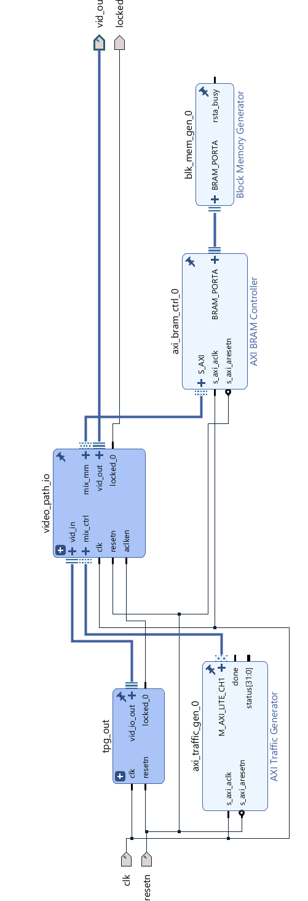
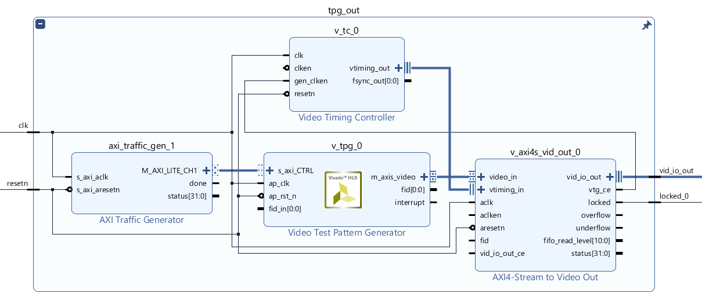
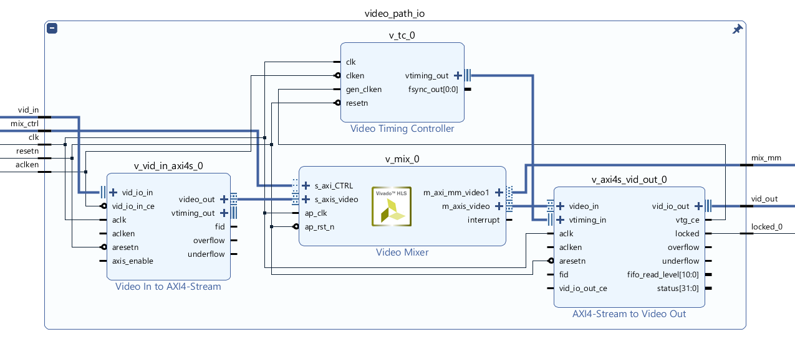
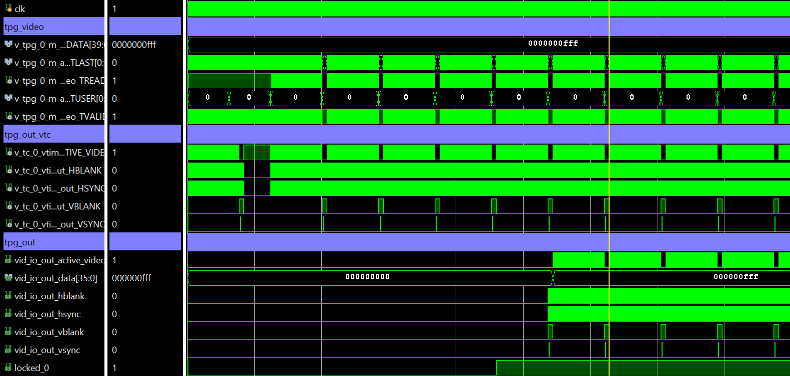
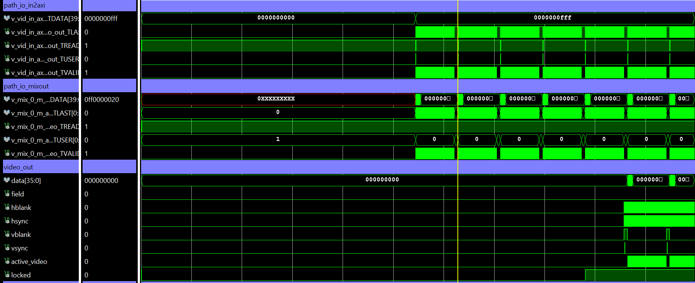

# VideoPath
by WeiLin, 2019.7.10

视频处理时，其实有很大工作是做视频的传输，也就是视频通路的搭建。很方便的是，Vivado里有很多相关IP，可以直接使用IP搭建视频通路。

### 1. Tpg Out

如果要测试视频输出，TPG(Test Pattern Generator)可以产生视频样例，比如Solid Color、Color Bar等。然后结合VTC(Video Timing Controller)和AXI4-Stream to Video Out就可以输出视频。ATG(AXI Traffic Generator)是用来配置TPG寄存器的，也可以用MicroBlaze或ARM配置。

需要注意的是：
- AXI4-Stream to Video Out配置成slave mode，并将vtg_ce连到VTC的gen_clken端，用于同步;  
- TPG的Controller Register需配置成0x00000081，而不是0x00000001，否则TPG只输出一帧。  
- AXI4-Stream to Video Out同步需要4~5个Vsync(在此期间没有任何输出)，所以需要较长仿真时间locked才为1，而且locked拉高后，数据也不是立即输出，需要等1帧时间才真正输出。

### 2. Direct Path

在一些视频处理里，往往需要两条通路：一条经VDMA将视频搬运到DDR，以供DSP或ARM处理；另一条直接输出，并显示处理结果。这条直接输出通路就是Direct Path，其可以用来测试Camera是否输出正常。

在实际应用中Vid_in连接Camera，这里为了仿真将TPG Out输出做输入。Video Mixer可以混合多个视频流或静态图层，方便在视频画面上显示视觉处理的结果等额外信息。也可以用OSD(Video On Screen Display)替代，不过Xilinx在2019.1停用OSD IP，不建议用于新设计。在叠加静态图层时，需将图像提前存入RAM里，这里用Block Memory Generator(结合AXI BRAM Controller使用)替代。用coe文件即可快速配置Block Memory的内容。

另外，这里使用了一个ATG(axi_traffic_gen_0)配置Mixer。如果只是在Vivado仿真以了解IP核的使用，除了ATG配置寄存器外，也可以用AXI Verification IP(不可综合)配置，会方便很多。

### 3. Sim Result
tpg_out仿真波形如下：

video_path_io仿真波形如下：

