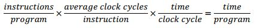

# 成本和性能
by WeiLin, 2019.7.20

RISC-V通过模块化及宏观融合，保证了RISC-V的简洁性。另外，还有特殊的指令格式、零寄存器的存在同样让RISC-V变得简洁。

#### 1. 成本
RISC-V的简洁使得芯片面积减小了，从而节约了成本。芯片越小，每个晶圆上切割出来的芯片越多。而且芯片越小，产率越高(因为晶圆上会散布一些小瑕疵，芯片越小，有缺陷部分占比越低)。

但这种成本的降低是否以牺牲性能为代价呢？

#### 2. 性能

性能可以用**CPU时间**来评估。CPU时间是处理器执行计算的时间，不包括磁盘访问、存储器访问、等待IO或运行其它程序的时间。

CPU时间 = 程序时钟周期数/时钟频率

**CPI(单条指令平均周期数)** = 程序时钟周期数/指令数

结合上述两个公式，并按测试单位展开即可得到如下性能公式：

CPU时间 = 指令数 x CPI x 时钟周期

可以看出，**处理器性能取决于三个特性：时钟周期(或时钟频率)、CPI、指令数**。这三个特性对CPU时间的影响是同等的，而且是相互关联的，所以很难在不改变其它两个参数的情况下改变其中一个。

“RISC-V作为一个简单的ISA可能在每个程序执行的指令数方面多余复杂的ISA，但它可以通过更快的时钟频率或更低的平均单条指令周期数(CPI)来弥补。”

因此，在性能方面上，RISC-V并不会落后。结合成本上的优势，其性价比会非常出色。

