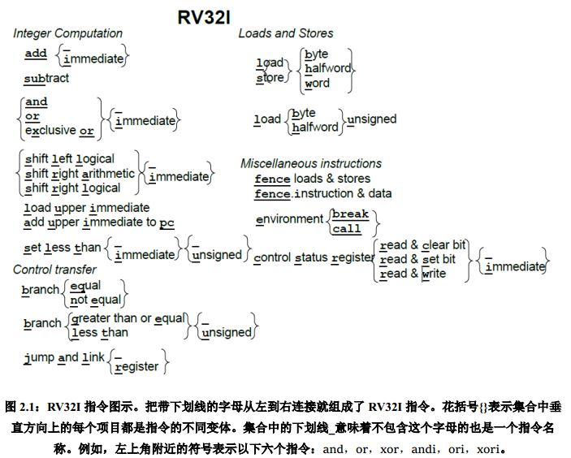
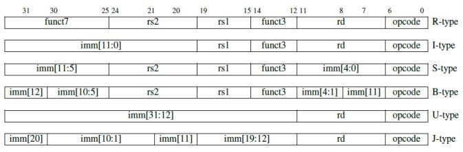
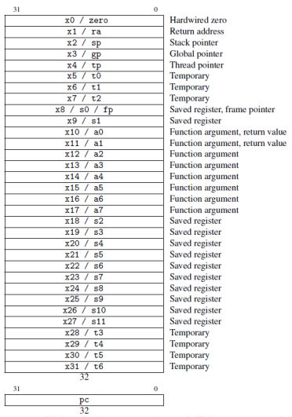

# RV32I:基础指令集
by WeiLin, 2019.7.20

RV32I是RISC-V基础整数指令集，是固定不变的核心模块。

### 1. 指令格式

RV32I有6种基本指令格式，分别是：用于寄存器-寄存器操作的R类型指令，用于短立即数和访存load操作的I型指令，用于访存store操作的S型指令，用于条件跳转操作的B类型指令，用于长立即数的U型指令和用于无条件跳转的J型指令。

其指令格式有如下特点：
1. 所有指令长度均为32位；
2. 指令提供3个寄存器操作数；
3. 寄存器标识符放在固定位置；
4. 立即数符号位总在指令的最高位；

RSIC-V在设计的时候就考虑了指令的编码，从而简化控制逻辑。

首先，指令长度为固定的32位，相比于x86的可变长度更加基于解码，而且32位长度提供了充足的指令空间。其次，RISC-V指令提供3个寄存器操作数，不像x86-32，让源寄存器和目的寄存器共享一个字段。

而且，**寄存器都放在了指令的固定字段**，这样做的好处是在解码指令之前就可先开始访问寄存器，而且简化了解码逻辑。

最后就是，**立即数的符号位总是在指令的最高位**。从指令格式图里可以看到，imm立即数被拆分成多个字段(而不是自然排布)，一个是保证寄存器标识总是在固定字段，另一个是保证符号位在最高位。而且**立即数总是符号扩展**，这样做的一个好处就是，可以用立即数表示负数(如果是零扩展的话，立即数不能表示负数)，从而省去立即数版本的sub(可以用addi代替)。

### 2. 寄存器
RV32I有32个寄存器：x0~x31，所以在指令格式图里可以看到寄存器需要5bit表示。其中，**x0为零寄存器**，恒为0。**零寄存器的存在使得RISC-V可以省掉很多没有零寄存器的ARM和x86中所必需的指令**，简化了指令集的设计。

例如addi x0,x0,0(x0寄存器加立即数0，结果存x0寄存器)表示nop(no operation无操作),sub rd,x0,rs为补码操作。“大多数的RISC-V伪指令(nop就是一个伪指令)依赖于x0，因此，把一个寄存器硬编码为0便于将许多常用指令——如跳转(jump)、返回(return)、等于0时转移(branch on equal to zero)——作为伪指令，进而简化RISC-V指令集。”

另外，**程序计数器(PC)不作为寄存器**。在ARM-32里，PC是16个寄存器之一，也就是说ARM-32任一指令都可能是分支指令，这为分支预测带来了困难。

