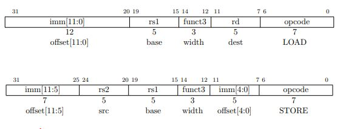

# RV32I:Load/Store指令
by WeiLin, 2019.7.22

RISC-V提供专门的Load、Store指令访问存储器，其它的普通指令无法访问存储器。加载和存储的支持的**唯一寻址模式是符号扩展12位立即数到基地址寄存器**，这在x86-32 中被称为位偏移寻址模式。

**RISC-V只支持小端格式(Little-Endian)**，即数据在memory中存放格式为：高字节放高地址，低字节放低地址。

### fence/fence.i指令

RV32I还提供用于屏障“数据”存储器访问(或设备IO访问)顺序的**fence指令**：“The FENCE instruction is used to order device I/O and memory accesses as viewed by other RISCV harts and external devices or coprocessors.”

RISC-V ISA支持多个并发线程在共享地址空间下执行，每个**硬件线程(hardware thread,or hart)** 有自己的寄存器状态、PC和独立的指令流。

**RISC-V采用Relaxed Memory Model(松散存储器模型)**，该模型对于不同地址的存储器读写指令的执行顺序不做要求，即地址A和地址B先访问哪个都可以。但有时候对于数据相关指令，地址A访问必须在B之前，那么就要使用fence明确保证此顺序。

在程序中如果添加fence指令，则在fence指令之前的所有存储器/设备IO访问指令，必须比fence之后的所有存储器/设备IO访问指令先执行。

fence.i 指令用于同步指令和数据流。对于同一个硬件线程，RISC-V不保证用存储指令写到内存指令区的数据可以被取指令取到。这是因为处理器采用流水线具有一定深度，当写存储器指令完成了写操作时，后续的指令可能已完成了取指令的取操作。所以需要使用fence.i同步，注意**fence.i只能保证同一个hart执行的指令和数据流顺序**。

### 存储器模型

存储器模型(Memory Model)，又称储存器一致性模型，是提前约定好的存储器访问需要遵循的规则。上面的松散模型(Relaxed Memory Model)就是一种。

- **顺序一致性模型**：每个进程访存指令是按序执行的，不能改变访问的顺序(即便是对不同地址的访问)。多个进程并行执行时，每个进程里的访存指令按序执行，进程间的访存指令是可以交叉执行的。

- **松散一致性模型**：对于不同地址的存储器访问指令，可以改变其执行顺序。松散一致性模型是顺序一致性模型的弱化，可以让CPU或编译器对程序进行优化。但有时也需要用存储器屏障指令Fence对访存顺序进行限制。

- **释放一致性模型**：支持Acquire-Release机制，释放指令(Release)屏障其之前的所有访存操作，而获取指令(Acquire)屏障其之后的访存指令.两条指令都是单方向的，而Fence指令是双向的。

