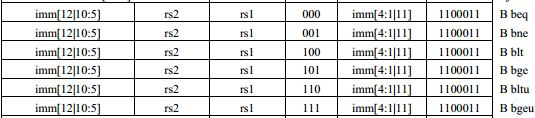
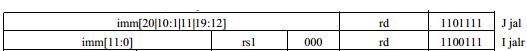

# RV32I:分支指令
by WeiLin, 2019.7.23

分支指令包含条件分支和无条件分支，RISC-V有2条无条件跳转指令和6条条件跳转指令。

#### 1. 条件跳转指令

由于RISC-V指令长度必须是两个字节的倍数(对于RV32I，指令长度为4)，所以分支指令的寻址方式是12位立即数乘以2，符号扩展后加到PC上作为分支跳转地址，也就是**PC相对寻址**。

**RISC-V没有使用条件码和分支延时槽**。

**条件码**：在指令的头几位作为条件码(ARM32是4位)，当对应的条件为真，该指令才被执行，否则被忽略。条件码的好处是可以将短的分支块编译成条件码指令(而不是分支跳转指令)，从而减少了分支跳转的机会。然而这些条件执行指令使用频率很低，会浪费宝贵的编码空间。

**分支延时槽**：分支会让流水线停顿，因此为了减少停顿，在分支指令后面紧跟若干条不受分支影响的指令，无论分支是否跳转，这些指令均会执行，从而减少了流水线停顿。早期MIPS有5级流水线，随着流水线级数越来越多，分支延时槽越来越长(意味着需要插入更多的无关指令)，给编译器、处理器带来难度。RISC-V取消分支延时槽的另一个原因是：现如今的分支预测器的准确度高达90%，所以没必要增加此开销。

*MIPS是“无互锁流水线微处理器”的缩写，就是通过分支延时槽避免流水线停顿/互锁。*

#### 2. 无条件跳转

像条件分支一样，jal(跳转并链接)指令将20为立即数乘以2，符号扩展后加到PC上得到跳转地址，并且其将下一个指令(PC+4)的地址保存到目标寄存器rd中。所以**jal可以用来进行子程序调用**。

jalr(jal的寄存器版本)可以用来子程序返回，只需rs1为jal的目标寄存器，rd为零寄存器即可实现程序返回。

#### 3. 函数调用

函数调用/返回有两种方法：stack memory、register file，使用寄存器会比使用栈更快以及更节约能耗。如果使用寄存器，一般为了不增加指令的bit数，会使用**寄存器窗口(Windowed AR Register File )**，比如说Tensilica Xtensa处理器。

*寄存器窗口就是为主函数和调用函数各分配16个寄存器(以Tensilica为例)，其中有8个是重叠的，用于传递参数、返回结果。但是Tensilica指令里只有4bit用于索引寄存器，也就是说每个函数在自己的16个寄存器里执行，但实际的物理寄存器是多于16个。*

RISC-V没有使用寄存器窗口，是因为RISC-V有充足的32个寄存器。“为了获得良好的性能，变量应该尽量存放在寄存器而不是内存中，但同时也要注意避免频繁地保存和恢复寄存器，因为它们同样会访问内存。RISC-V有足够多的寄存器来达到两全其美的结果：既能将操作存放在寄存器中，同样也能减少保存和恢复寄存器的次数。”