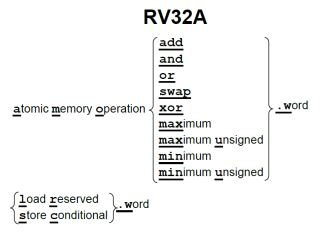

# RV32A:原子指令
by WeiLin, 2019.7.25

RV32A有两种类型的原子操作：
- Atomic Memory Operation(AMO,内存原子操作)
- Load Reserved/Store Conditional(LR/SC，加载保留/条件存储)

### 1. 原子操作
**原子的本意是“不能被进一步分割的最小粒子”，而原子操作意味“不可被中断的一个或一系列操作”**。“所谓原子操作(atomic operation)是指不会被线程调度机制打断的操作”。

举个例子就是i++操作，这是一个典型的“**读出-计算-写回(读改写)**”操作。如果有多个hart对共享变量i同时进行操作，那么i的值可能不是正确的值。所以必须保证“读改写”操作是原子的，即一个hart操作时，其它hart不能操作。

这种在同一时刻不允许其它hart访问的机制称为**上锁**，**通常是在总线上加入“Lock”信号来支持这种锁定功能**。

AMO指令实现从源寄存器1指定的地址处读出一个数据存放到目标寄存器中，并将读出的数据与源寄存器2的值进行计算(具体计算根据指令来，比如amoadd.w就是加法计算)，计算结果写会存储地址。可以看出AMO都是“读改写”操作，需要保存原子性。

### 2. 加载保留/条件存储

“加载保留和条件存储保证了它们两条指令之间的操作的原子性。加载保留读取一个内存字，存入目标寄存器中，并留下这个字的保留记录。而如果条件存储的目标地址上存在保留记录，它就把字存入这个地址。如果存入成功，它向目标寄存器中写入0；否则写入一个非0的错误代码。”

**加载保留就是当Load数据时，保留加载这个地址数据的记录。条件存储表示Store并不是总能成功，需要满足一定的条件：1.有LR访问过该地址的记录；2.LR和SC之间没有其它的写操作或中断；**

这样做的好处就是不用长时间将总线上锁，所以LR/SC指令可以不上锁保证操作的原子性。

### #获取/释放

所有的RV32A指令都有一个请求位(aq)和一个释放位(rl)。**aq被置位的原子指令保证其它线程在随后的内存访问中看到顺序的原子操作；rl被置位的原子指令保证其它线程在此之前看到顺序的原子操作。**

就如之间说的，RISC-V支持松散一致性模型(Relaxed Consistency model)，因此其它线程看到的内存访问可以是乱序的。为了保证访存的顺序，可以利用fence指令或这里的aq/rl机制。

