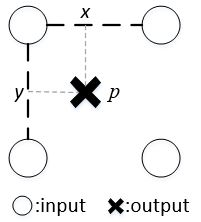
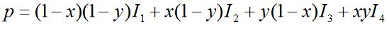
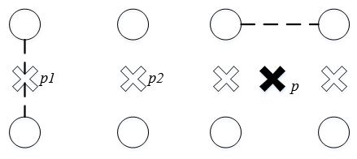
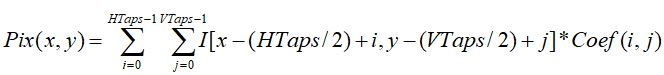
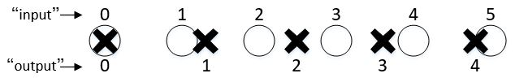

# VideoScaler
by WeiLin, 2019.8.10

第三届全国大学生集成电路创新创业大赛“紫光同创杯”的杯赛题目是：“基于PGL22的视频缩放算法实现”。事实上，在Xilinx FPGA中可以直接使用**Video Processing Subsystem IP(VPSS)** 的 **Scaler Only Mode** 实现视频缩放。但是如何自己设计Scaler IP呢？这里根据VPSS的使用谈谈自己的想法。

### 1. VPSS IP

“_The Video Processing Subsystem is a collection of video processing IP subcores._” 

VPSS是由多个IP Core组成，可以实现deinterlacing、scaling、color space conversion等功能。对于Scaler Only Mode由如下3个IP组成：

GPIO Reset用于软复位，Vertical Scaler实现纵向缩放，Horizontal Scaler实现水平缩放。也就是说，Video Scaler可以分为两步实现：1.**Vertical Scaler**; 2. **Horizontal Scaler**;

### 2. 插值(Interpolation)

当输出像素在原图的映射坐标是非整数时，就需要插值计算该像素值。VPSS有三种插值算法可以选择：Bilinear、Bicubic、Polyphase，以Bilinear(双线性插值)为例。

双线性插值(Bilinear)的输出像素值等于映射点周围2*2个像素的线性组合，组合方式由映射点与这4个像素的相对位置决定。

其中，I1，I2，I3，I4分别为左上、右上、左下、右下像素。由上述公式可以看出双线性插值是可以拆分成纵向插值和横向插值，如下图所示：

事实上，插值可以表示成下列公式。对于Bilinear，HTaps=VTaps=2，对于Bicubic，HTaps=VTaps=4，而对于Polyphase，Taps值会更大。Bilinear、Bicubic是Polyphase的特例。算法复杂度会随Taps增加而增加，相应的缩放效果也越好。而Coef是根据映射点与周围像素点的相对位置确定的，这里的相对位置即为相位。

### 3. 相位(Phase)

相位反映的是映射点与周围像素点的相对位置。比如对于下图横向缩放，输入6个像素，输出5个橡树。从图中可以看到存在4中相对位置关系，5个输出像素的相位分别为0，1，2，3，0。(该图根据Xilinx文档“Video Processing Subsystem v2.1”图3-5修改所画。)

VPSS里Polyphase有64个相位，对于HTaps=6，就有64*6个相位系数。一般情况下VTaps=HTaps，所以纵向缩放与横向缩放使用相同的相位系数。

那么在verilog里如何计算相位？依然以上图横向缩放为例。首先计算缩放比ratio=6/5=1.2，那么pixel_out[n]的映射坐标为n*ratio(n=0~4)。

将n*ratio放大2^16进行定点化，那么低16位表示小数部分，小数部分的高6为即为相位(假设有64个相位)。

### 4. 实现(Implementation)

Scaler原理还是相对简单的，但具体实现就需要考虑很多细节，这里只是给出自己的想法。比如相位是否能够实时计算，如果不能的话就需要提供一个相位表(事实上，VPSS就是这么做的，将相位提前计算好然后存入寄存器中)。还有就是边界问题(映射点在边界附近)、行缓存问题等。还有就是，由于输入像素并不是以固定的速度输入的，所以接口需采用AXI-Stream进行握手。总之，用Verilog实现VideoScaler IP还是相当麻烦的。