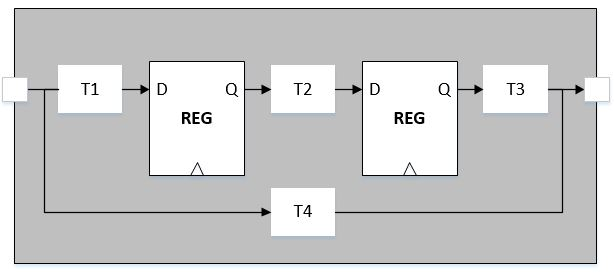
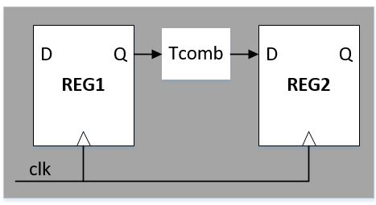
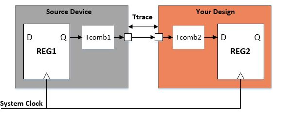
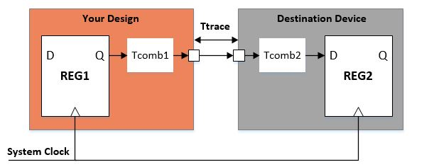
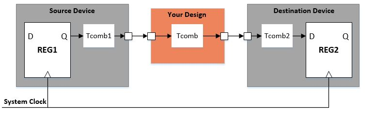

# 数字IC：STA
by WeiLin, 2019.8.16

STA(Static Timing Analysis,静态时序分析)分析所有可能组合路径的延时，并验证每一个时序路径(__Timing Path__)是否满足建立时间和保持时间约束。

存在4类Timing Path: __Input to Register, Register to Register, Register to Output, Input to Output__。

STA Tool的工作就是分析每条路径是否有时序上的违例，也就是计算时间裕度slack是否为正：
__
Setup Slack= Requred_time - Arrival time
__
__
Hold Slack=  Arrival time - Requred time
__

### 1. Register to Register

Register to Register是最好分析的，裕度计算公式如下(这里不考虑时间偏移)。Tclk为时钟周期，Tsetup为REG2建立时间，Thold为REG2保持时间，Tcomb为组合电路延时，Tclk-q为REG1传播延时。

__
Setup Slack= (Tclk - Tsetup) - (Tclk-q + Tcomb)
__
__
Hold Slack=  (Tclk-q + Tcomb) - Thold
__

### 2. Input to Register

Input to Register就需要Input Delay(在SDC里进行约束)，__Input Delay不是输入端口到触发器D端的延时，而是外部触发器Q端到输入端口的延时__。Tsetup、Thold为REG2的建立保持时间，Tclk-q为REG1的传输延时，Ttace为路径延时。

__
Setup Slack= (Tclk - Tsetup) - (Input Delay + Tcomb2)
__
__
Hold Slack=  (Input Delay + Tcomb2) - Thold
__
_
where, Input Delay=  Tclk-q + Tcomb1 + Ttrace
_

### 3. Register to Output

Register to Output需要Output Delay约束，__Output Delay是外部延时，是输出端口到外部触发器D端的延时__。Tsetup、Thold为REG2的建立保持时间，Tclk-q为REG1的传输延时，Ttace为路径延时。由于REG1是Lunch侧，所以hold slack需要取反。

__
Setup Slack= Tclk - Tclk-q - Tcomb1 - Output Delay1
__
_
Where, Output Delay1=Ttrace + Tcomb2 + Tsetup
_
__
Hold Slack=  - (Tclk-q + Tcomb1 + Output Delay2) 
__
_
Where, Output Delay2=Ttrace + Tcomb2 - Thold
_

### 4. Input to Output

由于组合电路路径没有时钟，所以需要在SDC里定义Virtual Clock，即Source Device和Destination Device使用的时钟。所以Input to Output需要考虑Input Delay和Output Delay，分析方法与前述一致。