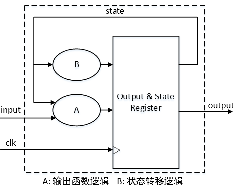
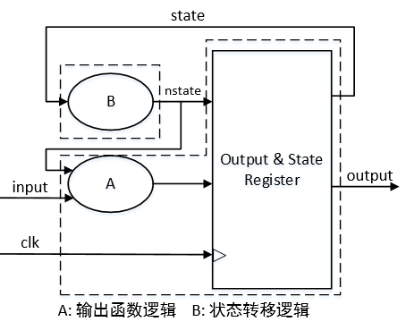
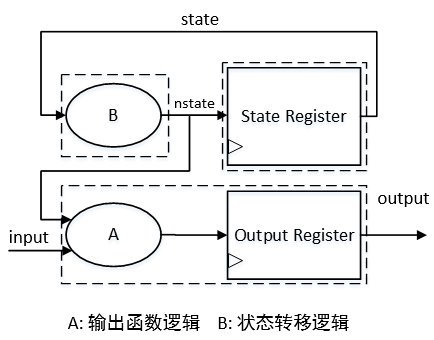
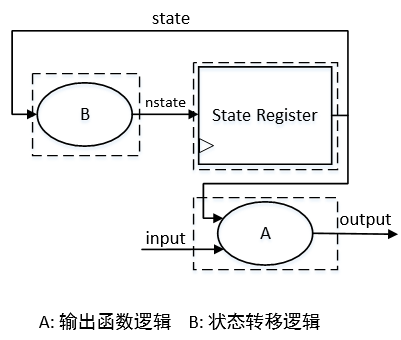

# 数字IC：FSM
by WeiLin, 2019.10.15

FSM(Finite State Machine,有限状态机)在数字设计里经常被用到，之前也做过整理，这里作为补充。

### 1. One Block

<center></center>

```verilog
(Example):
reg [1:0] state;
always@(posedge clk)begin
    if(rst)
        state<=IDLE;
	else begin
		case(state):
			IDLE:begin
				out<=0;
				state<=in?STATE1:STATE2;
			end
			.....
		endcase
	end
end
```
### 2. Two Block

<center></center>

```verilog
(Example):
reg [1:0] state,nstate;

always@(*)begin
	case(state)
		IDLE:nstate=in?STATE1:STATE2;
		.....
	endcase
end

always@(posedge clk)begin
	if(rst)begin
		state<=IDLE;
		out<=0;
	end
	else begin
		state<=nstate;
		case(nstate)://注意这里是nstate
			IDLE:out<=0;
			.....
		endcase
	end
end
```
### 3. Three Block

<center></center>

```verilog
(Example):
reg [1:0] state,nstate;

always@(*)begin
	case(state)
		IDLE:nstate=in?STATE1:STATE2;
		.....
	endcase
end

always@(posedge clk)begin
	if(rst)
		state<=IDLE;
	else
		state<=nstate;
end
	
always@(posedge clk)begin
	if(rst)
		out<=0;
	else begin
		case(nstate)://注意这里是nstate
			IDLE:out<=0;
			.....
		endcase
	end
end
```


#### #Three Block：Combinational Output
<center></center>

__输出应是寄存器输出，否则会有毛刺__。当然组合逻辑输出也是可以的,示例代码如下。__需要注意的是case的状态是当前状态state，而非前面的nstate__，这是因为组合逻辑在当前时钟周期下就可输出，而非像寄存器输出那样需要等到下一周期才输出。

```verilog
(Example):
reg [1:0] state,nstate;

always@(*)begin
	case(state)
		IDLE:nstate=in?STATE1:STATE2;
		.....
	endcase
end

always@(posedge clk)begin
	if(rst)
		state<=IDLE;
	else
		state<=nstate;
end
	
always@(posedge clk)begin
	if(rst)
		out<=0;
	else begin
		case(state)//注意这里是state
			IDLE:out<=0;
			.....
		endcase
	end
end
```