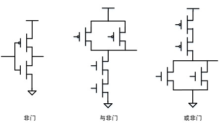

# 与非门-构建逻辑世界的积木
by WeiLin, 2021.08.20

与、或、非可以表示任意组合逻辑，但在CMOS层更基础的是与非门、或非门和非门，这是因为CMOS门电路只能搭建反向逻辑。如果使用CMOS电路搭建与门、或门，就需要2级结构(与非+非门)。

而与、或、非均可以用与非门构建，如下图所示。非门可以将与非门的两个输入短接，而与非门用与非+非门搭建，或门就需要使用德摩根定理转换：a+b = ~( ~a & ~b)。

那么如何使用与非门搭建异或门呢？过程推导如下：

异或为什么叫做异或呢？通俗的讲就是异常的或(Exclusive OR)，这点从各自的与非门结构可以看出来。异或与或唯一不同的点就是输入同时为1时，输出不为1。因此，在与非门结构里，异或多了一个与非门用于判断输入同时为1的情况。

因此，与非门可以构建基本的与或非，进而可以用与非门搭建所有组合逻辑。所以，与非门又称为通用逻辑门。事实上，或非门也是一种通用逻辑门，但因为或非门开关速度比与非门慢，所以一般更愿意使用与非门。