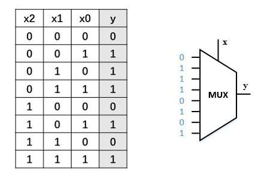

# MUX选择构建组合逻辑
by WeiLin, 2021.09.01

在逻辑设计中经常会使用MUX进行信号选择。除此之外，MUX还可以构建组合逻辑。

比如对于如下真值表示意的组合逻辑，可以用右边的MUX实现。只需将真值表输出项按顺序连接MUX的输入，查找项x作为MUX的选择端，那么就可以实现该组合逻辑。这也是查找表的实现原理，FPGA内部实现组合逻辑的方法就是用查找表。

如果想减少MUX的面积，可以将查找项的最低位作为MUX的输入，这样就可以将面积减少一半(以MUX选择项个数评估MUX面积)。而且MUX有一个优点：对于任何的输入，输出的延时都是相同的，也就是说其不存在组合逻辑中的关键路径一说。

但是MUX不适合构建过大的组合逻辑，因为会占用较大的面积。在ECO阶段，往往会用MUX构建与、或、非进行电路修补，这正是由于MUX的灵活性。

那么,异或门如何用MUX构建呢？其实异或的表达式中就蕴含着选择: y=a(~b)+(~a)b ：

不过，异或不能用一个MUX构建，至少需要2个，第一个用于实现~b，第二个做选择。