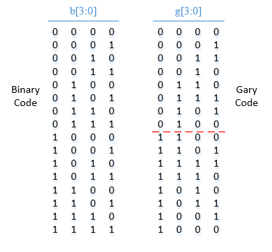
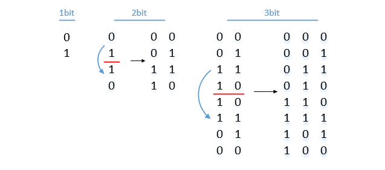
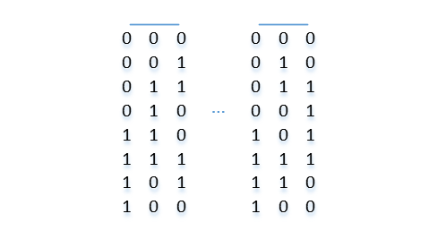
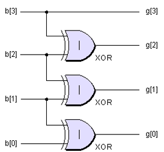
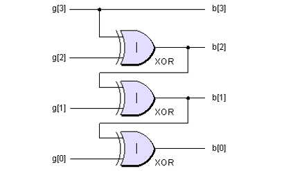
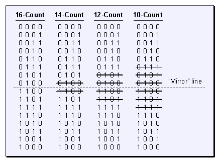
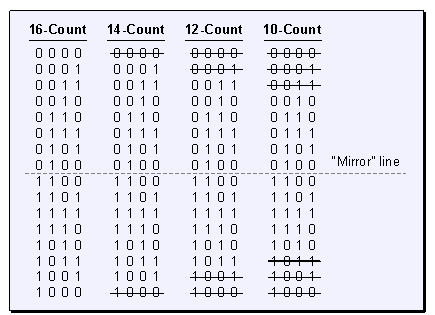
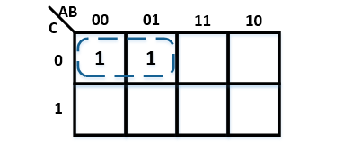

# 格雷码-码雷格
by WeiLin, 2021.09.06

格雷码是一种编码，其特点是相邻编码只有一bit不同。有意思的是，格雷码呈中心镜像对称，而且最高位与二进制编码相同。

<center></center>

利用格雷码这两个特点，可以快速书写任意bit的格雷码。首先，写下1bit的格雷码；然后将1bit格雷码作镜像对称，并在高bit的前半部分填充0，后半部分填充1，就得到了2bit格雷码；同样，将2bit格雷码作镜像对称，并在高bit的前半部分填充0，后半部分填充1，就得到了3bit格雷码。以此类推，可得到任意bit的格雷码。

<center></center>

那么是不是“相邻码只有1bit不同”仅有一种排布呢？并不是，比如3bit格雷码，列之间进行任意互换，均能得到“相邻码只有1bit不同”。所以对于3bit，存在6种这样的排布，但一般用第一种就可以了。

<center></center>

## 二进制码<->格雷码

二进制码到格雷码的转换比较简单，最高位直接输出，其它位通过相邻二进制位异或得到。而且，异或门是‘并联’的，所以只需要一级门逻辑即可输出。

```verilog
assign gray = bin ^ (bin >> 1);
```

<center></center>

而格雷码转换成二进制就是上图的反向运算，会发现异或门是‘串联’的，所以格雷码到二进制的转换会有比较大的延时。

```verilog
localparam n = 4;
assign bin = {gray[n-1], (bin[n-1:1]^gray[n-2:0])};
```

<center></center>

## 格雷码裁剪

格雷码个数是bit位数的幂次，比如对于4bit，就有2^4=16个格雷码。但事实上，经过对称裁剪，格雷码依然能够保证其特性：相邻码之间只有1bit变化。经过裁剪，可以构建偶数个“格雷码”，这个特性在构建异步FIFO是有很大用处。

<center></center>

<center></center>

## 格雷码应用

用于逻辑化简的卡诺图会使用格雷码进行bit排布，那么为什么卡诺图要使用格雷码？
这是基于公式：PX+P\bar{X}=P

当乘积项之间存在一个变量相异时可以将其合并。而格雷码可以保证相邻最小项之间一定存在变量X是相异的，从而进行化简。

<center></center>

格雷码还用于多bit跨时钟同步，比如异步FIFO中的地址就是使用格雷码。