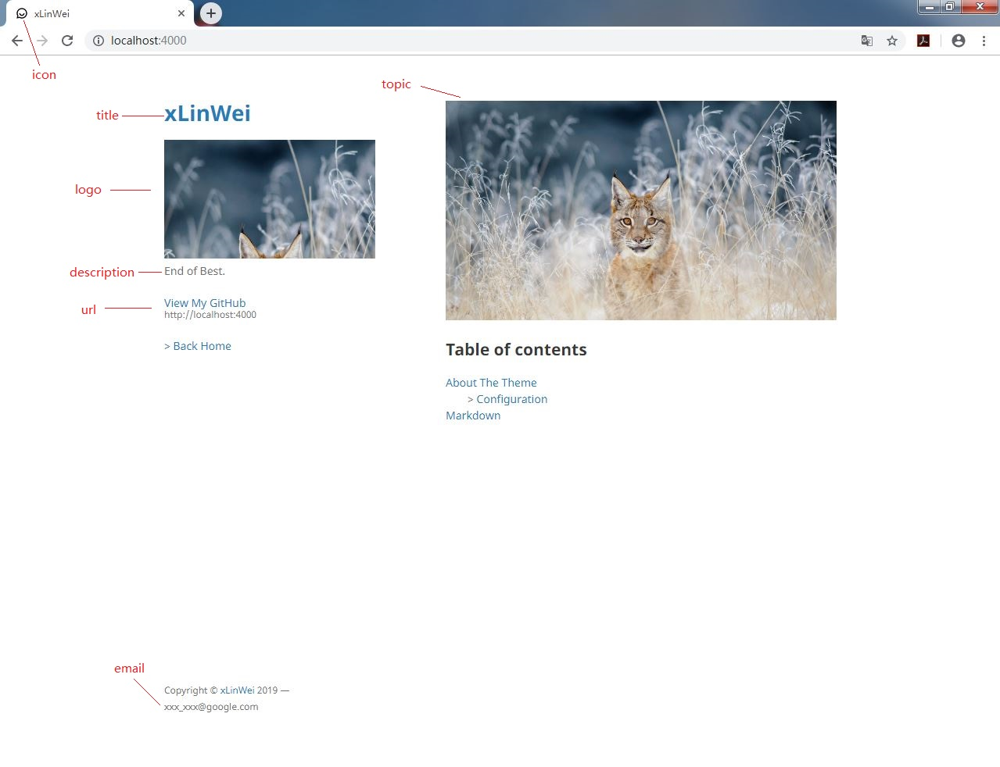

# Configuration Guild
by WeiLin,	2019-5-10

All Configuration Parameters are in _config.yml:
```yml
title: WeiLin
logo: /assets/img/logo.png
icon: /assets/img/icon.png
topic: /assets/img/topic.jpg
description: End of Best.
email: xxxxxx0@google.com
url: https://github.com/xLinWei
theme: jekyll-theme-minimal
```

You can change it to youself.

