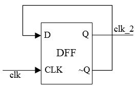
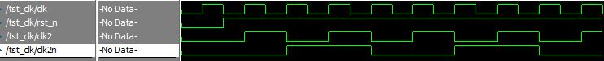
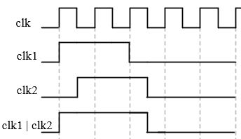
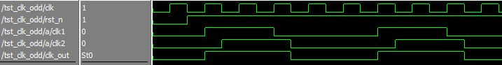
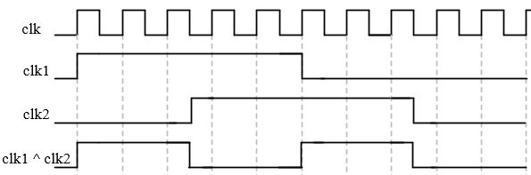
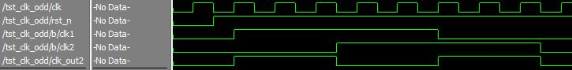

## vlog_day11:时钟分频
by [WeiLin](https://github.com/xLinWei)

时钟分频分为：偶数分频、奇数分频
### 1.偶数分频
<center></center>
二分频用一个触发器即可实现：

```verilog
module clk_2(
    input clk,rst_n,
    output reg clk_out
);

    always@(posedge clk or negedge rst_n)begin
        if(!rst_n)
            clk_out<=0;
        else
            clk_out<=~clk_out;
    end

endmodule
```

大于2的偶数分频就需要用到计数器了：
```verilog
module clk_even #(parameter N=4)(
    input clk,rst_n,
    output reg clk_out
);
    localparam n=N/2;

    reg [3:0] cnt;
    always@(posedge clk or negedge rst_n)begin
        if(!rst_n)begin
            cnt<=0;
            clk_out<=0;
        end
        else if(cnt==n-1)begin
            cnt<=0;
            clk_out<=~clk_out;
        end
        else begin
            cnt<=cnt+1;
            clk_out<=clk_out;
        end
    end

endmodule
```
<center></center>

### 2.奇数分频
奇数分频需要在上升沿和下降沿分别计数，然后"错位相或"或者"错位异或"即可，所以可以分成以下两个方法(以5分频为例)：
#### 方法1：错位相或
<center></center>

```verilog
module clk_odd1 #(parameter N=5)(
    input clk,rst_n,
    output clk_out
);
    localparam n=N/2;//对于N=5，n=2

    reg [3:0] cnt;//只需1个计数器就可以
    reg clk1,clk2;

    always@(posedge clk or negedge rst_n)begin
        if(!rst_n)
            cnt<=0;
        else
            cnt<=(cnt==N-1)?0:cnt+1;
    end

    always@(posedge clk or negedge rst_n)begin
        if(!rst_n)
            clk1<=0;
        else begin
            if(cnt==0 || cnt==n)
                clk1<=~clk1;
            else
                clk1<=clk1;
        end
    end

    always@(negedge clk or negedge rst_n)begin
        if(!rst_n)
            clk2<=0;
        else begin
            if(cnt==1 || cnt==n+1)
                clk2<=~clk2;
            else
                clk2<=clk2;
        end
    end

    assign clk_out=clk1 | clk2;

endmodule
```

<center></center>

#### 方法2：错位异或
<center></center>

```verilog
module clk_odd2 #(parameter N=5)(
    input clk,rst_n,
    output clk_out
);
    localparam n=N/2;
    reg [3:0] cnt;
    reg clk1,clk2;

    always@(posedge clk or negedge rst_n)begin
        if(!rst_n)
            cnt<=0;
        else
            cnt<=(cnt==N-1)?0:cnt+1;
    end

    always@(posedge clk or negedge rst_n)begin
        if(!rst_n)
            clk1<=0;
        else begin
            if(cnt==0)
                clk1<=~clk1;
            else
                clk1<=clk1;
        end
    end

    always@(negedge clk or negedge rst_n)begin
        if(!rst_n)
            clk2<=0;
        else begin
            if(cnt==n+1)
                clk2<=~clk2;
            else
                clk2<=clk2;
        end
    end

    assign clk_out=clk1 ^ clk2;

endmodule
```
<center></center>


