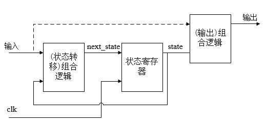
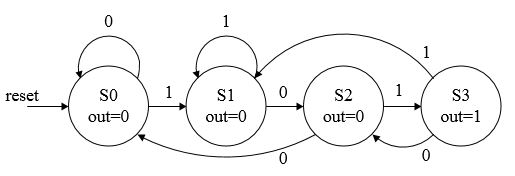

## vlog_day16:有限状态机
by [WeiLin](https://github.com/xLinWei)

FSM有限状态机分为Moore(摩尔型)和Mealy(米里型)两类：**(1)Moore** :输出只取决于当前状态，与输入没有关系；**(2)Mealy** :输出既取决于当前状态，又取决于输入；
<center></center>

状态机如上图所示，可以分为3个部分:  
**(1)状态转移组合逻辑** : 由当前状态(state)计算下一状态(next_state);  
**(2)状态寄存器**:保存state，每个时钟会将next_state更新到寄存器中；  
**(3)输出组合逻辑**：由(输入)和当前状态计算输出；

FSM有3种写法：一段式、两段式、三段式，下面以101序列检测器为例来展示不同的写法。首先画出101序列检测器的泡泡图：
<center></center>

一段式是将状态转移逻辑、输出逻辑和状态更新包含在一个always时序块里。对于简单的状态机，一段式便于理解，但对于较为复杂的FSM就不适用了。

```verilog
//101序列检测器:一段式
module seq101(
	input clk,rst,in,
	output reg out
);
	localparam S0=2'b00,S1=2'b01,S2=2'b10,S3=2'b11;

	reg [1:0] state;
	always@(posedge clk or posedge rst)begin
		if(rst)begin
			out<=0;
			state<=S0;
		end
		else begin
			case(state)
				S0:begin
					state<=in?S1:S0;
					out<=0;
				end
				S1:begin
					state<=in?S1:S2;
					out<=0;
				end
				S2:begin
					state<=in?S3:S0;
					out<=0;
				end
				S3:begin
					state<=in?S1:S2;
					out<=1;
				end
			endcase
		end
	end

endmodule
```
而两段式是用一个时序always块描述状态更新，一个组合always块描述状态转移逻辑、输出逻辑。两段式中输出是来自组合逻辑的，会有毛刺。
```verilog
//101序列检测器：两段式
module seq101_2(
	input clk,rst,in,
	output reg out
);
	localparam S0=2'b00,S1=2'b01,S2=2'b10,S3=2'b11;

	reg [1:0] state,next_state;
    always@(posedge clk or posedge rst)begin
        if(rst)
            state<=S0;
        else
            state<=next_state;
    end

	always@(*)begin
        case(state)
			S0:begin
				next_state<=in?S1:S0;
				out<=0;
			end
			S1:begin
				next_state<=in?S1:S2;
				out<=0;
			end
			S2:begin
				next_state<=in?S3:S0;
				out<=0;
			end
			S3:begin
				next_state<=in?S1:S2;
				out<=1;
			end
		endcase
	end

endmodule
```
一般而言，应该使用三段式，将状态转移逻辑、输出逻辑和状态更新分别用一个always块描述。而且这种描述方法符合状态机的结构划分。**需要注意的是输出需要取自触发器，而不是组合逻辑，否则会产生毛刺。**
```verilog
//101序列检测器：三段式
module seq101_3(
	input clk,rst,in,
	output reg out
);
	localparam S0=2'b00,S1=2'b01,S2=2'b10,S3=2'b11;

	reg [1:0] state,next_state;
    always@(*)begin
        case(state)
			S0:next_state<=in?S1:S0;
			S1:next_state<=in?S1:S2;
			S2:next_state<=in?S3:S0;
			S3:next_state<=in?S1:S2;
			default:next_state<=S0;
		endcase
	end

    always@(posedge clk or posedge rst)begin
        if(rst)
            state<=S0;
        else
            state<=next_state;
    end

	always@(posedge clk or posedge rst)begin
        if(rst)
            out<=0;
        else begin
            case(state)
			S0:out<=0;
			S1:out<=0;
			S2:out<=0;
			S3:out<=1;
			default:out<=0;
		endcase
        end
	end

endmodule
```